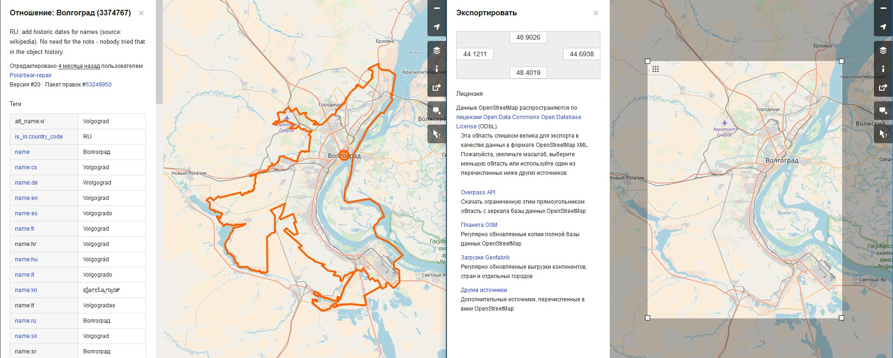

# Скачивание карты города

- ### Способ 1 (самый простой, но не самый аккуратный) - скачать прямоугольную область:
  - зайти на главную [страницу](https://www.openstreetmap.org/export#map=9/59.9667/30.4184)
  - нажать `выделить другую область`
  - выделить нужный город
  - нажать `скачать с Overpass API`
  - добавить расширение `.osm` для скачанного файла 

Проблема — очень редко можно подобрать подходящий прямоугольник для границы города. Может попасть очень много лишнего, например:

- ### Способ 2 (аккуратный и точный, но требует времени и не такой простой) - скачать данные только для города:
  - Узнать `Relation ID`:
    - зайти на главную [страницу](https://www.openstreetmap.org/export#map=9/59.9667/30.4184)
    - в поиске вбить название города
    - выбрать нужный вариант из списка
    - убедиться по карте, что выбран верный город
    - `Relation ID` находится в левом верхнем углу:  
    
  - Получить `полигон` для города:
    - зайти на [сайт](http://polygons.openstreetmap.fr/)
    - ввести `Relation ID` из предыдущего пункта  
    
    - и нажать `Submit`
    - Выбрать `poly` из предложенных форматов
    
    - Скопировать все (`Ctrl+A`, `Ctrl+C`), создать файл `<название города>.poly` (например `volgograd.poly`)
    - Пример файла `*.poly` можно посмотреть [`здесь`](../data/volgograd.poly)
  - Скачать карту региона
    - зайти на [сайт](https://download.geofabrik.de/russia.html)
    - выбрать регион, в котором расположен город (подсказка: если вы не уверены в регионе, то по нажатию на регион в новой странице откроется карта с выделенным регионом, где вы можете проверить принадлежит ли данному региону ваш город)
    - скачать в формате `*.osm.pbf`  
     
  - Установить [`Osmosis`](https://wiki.openstreetmap.org/wiki/Osmosis). Инструкция для [Linux](https://wiki.openstreetmap.org/wiki/Osmosis/Installation#Linux), [Mac OS](https://wiki.openstreetmap.org/wiki/Osmosis/Installation#OS_X), [Windows](https://wiki.openstreetmap.org/wiki/Osmosis/Quick_Install_(Windows))
  - С помощью `Osmosis` получить карту только для города. (Для `Windows` проще всего перенести полигон и карту региона в папку `osmosis-latest\bin`). И с помощью командой строки запустить следующую команду:  
  `osmosis --read-pbf-fast file="YOUR-REGION-latest.osm.pbf" --bounding-polygon file="CITY-NAME_STATE.poly" --write-xml file="CITY-NAME_STATE.osm"`.  
  Например: `osmosis --read-pbf-fast file="south-fed-district-latest.osm.pbf" --bounding-polygon file="volgograd.poly" --write-xml file="volgograd.osm"`
  - Дождаться выполнения команды
  - Необходимый файл будет иметь расширение `.osm`

___

## Примечания
- Независимо от выбранного Вами способа, формат полученного документа будет идентичен. Разница лишь в области, которая попадет в файл
- Спасибо за второй пункт [JamesChevalier](https://github.com/JamesChevalier/cities)
