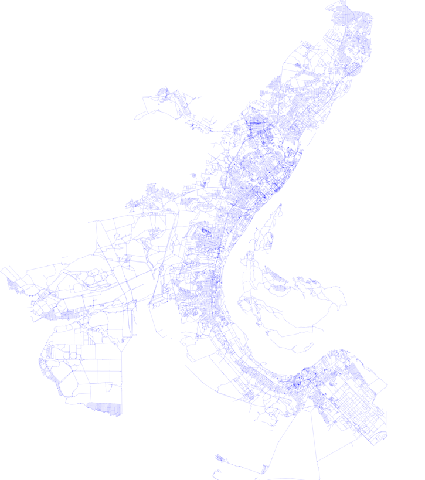

# Результаты для Волгограда

___

* [Визуализация](#визуализация)
* [Информация о вершинах](#информация-о-вершинах)
* [Список смежности](#список-смежности)
* [Матрица смежности](#матрица-смежности)

___

# Визуализация

Для визуализации было выбрано использовать формат `svg`.

Несколько этапов развития проекта (для удобства буду приводить лишь скриншоты)

1. Самое начало - отображение лишь участка, без географических преобразований и подбора ширины линий 

2. Отображение всех линий (`way`) 

3. Отображение всех линий, у которых есть ключ `highway`. Хорошо заметен "наклон" карты 

4. После выполнения географических преобразований 

5. После удаления неавтомобильных дорог и раскрашивания в зависимости от важности

Волгоград на _openstreetmap_:  

 

Нетрудно заметить сходство по структуре и форме

Волгоград на _google maps_:  

*__Итоговую визуализацию__* можно скачать [отсюда](https://github.com/bruce-willis/City-Roads/releases). Файл — `map.svg`

# Информация о вершинах

Построение таблицы вида:
| Id | Latitude | Longitude | Y | X |
|----|----------|-----------|---|---|
Результат для первых 1000 точек можно посмотреть [здесь](../src/Output/nodes_list.csv)

*__Целую таблицу__* можно скачать [отсюда](https://github.com/bruce-willis/City-Roads/releases). Файл — `nodes_list.csv`  

*Примечание*: Если вы открываете таблицу в Excel и данные не разделены по столбцам, воспользуйтесь [данным](https://superuser.com/questions/606272/how-to-get-excel-to-interpret-the-comma-as-a-default-delimiter-in-csv-files/686415#686415) способом

# Список смежности

Построение таблицы вида:
| Id | Adjacent nodes |
|----|----------------|
Результат для первых 1000 точек можно посмотреть [здесь](../src/Output/adjacency_list.csv)

*__Целую таблицу__* можно скачать [отсюда](https://github.com/bruce-willis/City-Roads/releases). Файл — `adjacency_list.csv`  
*Примечание*: Если вы открываете таблицу в Excel и данные не разделены по столбцам, воспользуйтесь [данным](https://superuser.com/questions/606272/how-to-get-excel-to-interpret-the-comma-as-a-default-delimiter-in-csv-files/686415#686415) способом

# Матрица смежности

Построение таблицы вида:
|     | ID1 | ID2 | ... | IDN |
|-----|-----|-----|-----|-----|
| ID1 | 0   | 1   |     | 0   |
| ID2 | 1   | 0   |     | 0   |
| ... |     |     |     |     |
| IDN | 0   | 0   |     | 0   |
Где по горизонтали и вертикали - ID вершин, где aij = 1 если есть ребро из вершины *i* в вершину *j* и 0 в противном случае.

Матрица смежности получается крайне огромной - 69'776 x 69'776 размерностью и более 41Гб на диске.

Причем использование этой матрицы крайне неоправданно — в графе всего лишь 272`855 из 2'434'310'200 (что составляет ~0.011% от возможного) — то есть граф является *сильно разряженным* и большинство элементов в этой матрице будут нулевыми